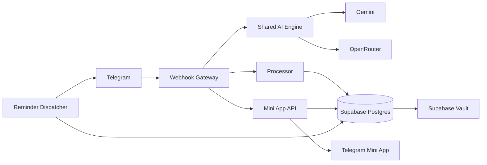

<div align="center">

# ✦ Nexa

### Telegram-native AI assistant with a secure Mini App, personal API keys, automation, and provider-first AI.

[](./supabase/functions/_shared/version.ts)
[](https://github.com/sanyzrn/AiTelegramBot/actions/workflows/v9-regression.yml)
[](https://github.com/sanyzrn/AiTelegramBot/actions/workflows/shared-typecheck.yml)
[](https://github.com/sanyzrn/AiTelegramBot/actions/workflows/migrations-check.yml)
[](https://github.com/sanyzrn/AiTelegramBot/actions/workflows/deploy-supabase.yml)

**Gemini · OpenRouter · Supabase · Telegram Mini Apps · Deno**

</div>

---

## What is Nexa?

**Nexa** is a Telegram-first AI assistant built as a real application, not just a chat wrapper.

It combines conversational AI with practical everyday tools such as reminders, tasks, expenses, shopping lists, document and media understanding, live web search, voice workflows, morning briefings, and a full Telegram Mini App dashboard.

Nexa follows a **provider-first architecture**: the selected provider and model are respected across AI features. Users outside the main allowlist can also connect their **own Gemini or OpenRouter API key** through a secure BYOK flow.

## Highlights

| Area | What Nexa does |
| --- | --- |
| 🤖 **AI chat** | Gemini, OpenRouter or any OpenAI-compatible endpoint, configurable models, tones, answer length and provider-aware capabilities |
| 🔑 **Personal API keys** | Self-service BYOK for Gemini/OpenRouter/custom OpenAI-compatible endpoints, stored server-side in Supabase Vault |
| 🌐 **Live search** | Provider-aware grounded web search with source handling |
| 🖼️ **Media & files** | Images, OCR, voice, audio, PDF and document analysis |
| ⏰ **Life tools** | Reminders, recurring schedules, tasks, expenses, shopping lists and memories |
| 📊 **Mini App** | Telegram-native dashboard for tasks, reminders, expenses, shopping, settings and analytics |
| ☀️ **Briefings** | Scheduled morning briefing, weather, market context, tasks and reminders |
| 🔔 **Watchers** | Conditional alerts such as rain, exchange-rate and gold thresholds |
| 🛡️ **Admin controls** | Access management, quotas, provider/model selection and operational settings |
| 🧪 **Quality gates** | Regression tests, strict TypeScript checks, migration tests and verified production deploys |

## Mini App

The dashboard is a lightweight Telegram Mini App with RTL support, light/dark themes, haptics, Persian-friendly date handling, responsive layouts and signed Telegram authentication.

It currently covers:

- Today overview and quick actions
- Tasks and reminders
- Expense tracking and charts
- Shopping lists and sharing
- Memories and watchers
- Briefing, city and timezone settings

The static frontend lives in [`webapp/index.html`](webapp/index.html).  
Its backend is the [`saeed-ai-webapp`](supabase/functions/saeed-ai-webapp) Edge Function.

## Personal API keys (BYOK)

Users who are not in the main access list are not forced into a dead end. Nexa can offer two paths:

1. Send their Telegram Chat ID to the administrator and request access.
2. Use their own **Gemini**, **OpenRouter** or **custom OpenAI-compatible** API key.

The custom option asks for three things — the API address (public `https` only), the model name and the key — and verifies all three with one tiny completion before saving anything.

Personal keys are validated before use and stored in **Supabase Vault**. The public application tables store only provider metadata and a secret reference, never the API key itself.

Explicit administrator blocks remain authoritative and cannot be bypassed with a personal key.

## Architecture



### Runtime components

- **`saeed-ai-ui`**: Telegram webhook gateway, access control, rate limiting, fast chat and routing.
- **`saeed-ai-v7`**: processor for tools, media, documents, life commands and admin operations.
- **`saeed-ai-reminders`**: scheduled reminders, briefings, watchers, weekly summaries and cleanup.
- **`saeed-ai-webapp`**: signed API for the Telegram Mini App.
- **`_shared/`**: provider adapters, prompts, capabilities, Telegram transport, routing, parsers and shared business logic.

> Internal deployment identifiers still use the historical `saeed-ai-*` names for backward compatibility. The user-facing product is **Nexa**.

## Security

Nexa is designed around server-side trust boundaries:

- Telegram webhook secret validation
- Telegram Mini App `initData` signature verification
- Supabase service-role-only backend operations
- Row Level Security on private application tables
- Personal API keys stored in Supabase Vault
- Per-user access checks and explicit admin blocking
- Gateway rate limiting
- No committed credentials or user data
- Strict TypeScript with no `@ts-ignore`, `@ts-nocheck` or `@ts-expect-error`
- Deployment blocked when the live database schema is behind the code

No system is perfectly secure, so production secrets should still be scoped, rotated when necessary, and kept out of logs and client-side code.

## Quick start

### 1. Clone

```bash
git clone https://github.com/sanyzrn/AiTelegramBot.git
cd AiTelegramBot
```

### 2. Configure secrets

Copy [`.env.example`](.env.example) and configure the required Telegram, Supabase and AI provider credentials.

**Custom (OpenAI-compatible) provider.** Admins can select a third provider from the models page: set `CUSTOM_API_KEY` as a project secret, then use `🔗 آدرس Custom` (e.g. `https://api.openai.com/v1`) and `✏️ مدل Custom` in the admin panel. Any server that implements `POST {base}/chat/completions` works. Image/audio/PDF input is attempted at runtime and fails gracefully; the «🌐 آنلاین» tool and voice-out stay Gemini/OpenRouter-only because a generic endpoint cannot return verifiable sources.

For production, store secrets in **Supabase project secrets** rather than committing a local `.env`.

### 3. Apply database migrations

Migrations live in [`supabase/migrations`](supabase/migrations).

The migration test workflow applies the migration chain to a clean PostgreSQL database and verifies important behavioural contracts.

### 4. Deploy Edge Functions

The canonical production pipeline is:

[`.github/workflows/deploy-supabase.yml`](.github/workflows/deploy-supabase.yml)

It performs type checking, regression tests, schema validation, Edge Function deployment and live health verification.

### 5. Host the Mini App

Host [`webapp/index.html`](webapp/index.html) on HTTPS and set `WEBAPP_URL` to the resulting Telegram Mini App URL.

## Repository layout

```text
.
├── .github/workflows/        # CI, migration checks and production deployment
├── docs/                     # Architecture notes, reviews and changelog
├── supabase/
│   ├── functions/
│   │   ├── _shared/          # Shared AI, routing and business logic
│   │   ├── saeed-ai-ui/      # Telegram gateway
│   │   ├── saeed-ai-v7/      # Processor
│   │   ├── saeed-ai-reminders/
│   │   └── saeed-ai-webapp/  # Mini App API
│   └── migrations/           # Database schema and RPC migrations
├── tests/                    # Regression, architecture and migration tests
└── webapp/                   # Telegram Mini App frontend
```

## Development checks

```bash
deno check supabase/functions/_shared/*.ts
node --experimental-strip-types --test tests/*.test.mjs
```

Function-specific entrypoints are also type-checked by CI with strict TypeScript settings.

## Release model

The single source of truth for the application and required database versions is:

[`supabase/functions/_shared/version.ts`](supabase/functions/_shared/version.ts)

A production deployment is considered healthy only when the deployment workflow verifies the expected version and capability flags on every live Edge Function.

## Documentation

- [Changelog](docs/CHANGELOG.md)
- [Project review](docs/PROJECT_REVIEW.md)
- [Environment variables](.env.example)
- [Supabase migrations](supabase/migrations)
- [Production deploy workflow](.github/workflows/deploy-supabase.yml)

---

<div align="center">

Built for Telegram. Designed to stay useful after the novelty wears off.

**Nexa · v10.6.0**

</div>
